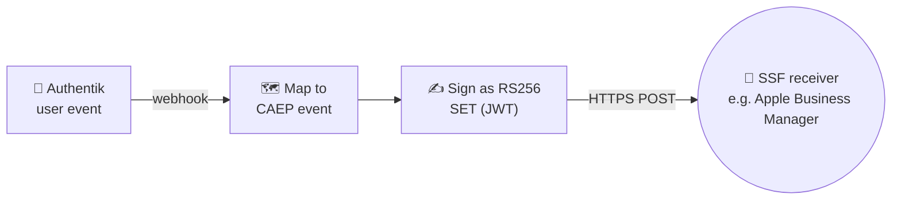

# SSF Transmitter

<p align="center">
  <a href="https://github.com/solarssk/ssf-transmitter/actions/workflows/ci.yml"></a>
  &nbsp;
  <a href="https://codecov.io/gh/solarssk/ssf-transmitter"></a>
  &nbsp;
  <a href="https://sonarcloud.io/summary/new_code?id=solarssk_ssf-transmitter"></a>
  &nbsp;
  <a href="https://github.com/solarssk/ssf-transmitter/releases/latest"></a>
  &nbsp;
  <a href="LICENSE"></a>
</p>

<p align="center">
  <a href="https://hub.docker.com/r/solarssk/ssf-transmitter"></a>
  &nbsp;
  
  &nbsp;
  
  &nbsp;
  
</p>

<p align="center">
  <strong>Self-hosted Shared Signals Framework bridge for Authentik.</strong><br>
  Push real-time session-revoked and credential-change events straight to Apple Business Manager, or any SSF receiver: no SaaS relay, no vendor lock-in.
</p>

<details>
<summary><strong>Table of contents</strong></summary>

- [What it does](#what-it-does)
- [How it works](#how-it-works)
- [Features](#features)
- [Stack](#stack)
- [Quick start](#quick-start)
- [Upgrading](#upgrading)
- [Public endpoints](#public-endpoints)
- [Security at a glance](#security-at-a-glance)
- [Documentation](#documentation)
- [Apple SCIM group filtering](#apple-scim-group-filtering)
- [Development](#development)
- [Contributing](#contributing)
- [License](#license)

</details>

## What it does

Standalone service that sits next to Authentik and forwards user security events (logout, password change) to receivers implementing the [OpenID Shared Signals Framework](https://openid.net/specs/openid-sharedsignals-framework-1_0.html). One container supports one active SSF stream; registering a new stream replaces the existing one. Multi-stream support (fan-out to multiple receivers) is planned for v1.1. Primary receiver: Apple Business Manager CAEP.

Events are signed as RS256 JWTs (Security Event Tokens) and pushed over HTTPS. No admin panel: all configuration is environment variables.

## How it works



A logout or password change in Authentik fires a webhook; the payload is mapped to a CAEP `session-revoked` or `credential-change` event, signed as a JWT, and pushed to every enabled stream's receiver. Optionally, a separate background loop keeps an Apple Business Manager user directory in sync via SCIM: see [docs/Apple-SCIM-Sync.md](docs/Apple-SCIM-Sync.md).

## Features

| | Feature | What it does |
|---|---------|---------------|
| 📡 | **SSF discovery and JWKS endpoints** | Standard `.well-known/ssf-configuration` and `jwks.json` so receivers can auto-discover and verify signatures. |
| 🛠️ | **Stream management API** | Create, read, update, and delete the single active SSF stream over a management Bearer token. |
| 🪝 | **Flexible webhook auth** | Bearer token (recommended) or legacy HMAC-SHA256 signature for the Authentik webhook. |
| 🗺️ | **CAEP event mapping** | Logout and password-change Authentik events map to `session-revoked` and `credential-change` SETs. |
| ✍️ | **RS256-signed SET delivery** | Every push is a signed JWT, revalidated against SSRF and DNS-rebinding checks right before it goes out. |
| 🚦 | **Defense in depth** | Receiver hostname allowlist, in-app rate limiting, and standard HTTP security headers on every response. |
| 🔒 | **Encrypted receiver tokens** | Fernet-encrypted at rest in SQLite; management and webhook tokens never touch disk. |
| 🕵️ | **PII masked by default** | Email addresses are pseudonymised in logs unless explicitly opted out. |
| 👥 | **Apple SCIM user sync** | Optional directory sync from Authentik to Apple Business Manager, scoped to a single group if you want. |
| ✅ | **Startup preflight checks** | Clear ✅/⚠️/❌ output per check before the service starts serving traffic. |
| 🐳 | **Multi-arch image** | Published for `linux/amd64` and `linux/arm64`, to both GHCR and Docker Hub. |

## Stack

| | Layer | Technologies |
|---|-------|---------------|
| 🐍 | **Runtime** | Python 3.14 |
| ⚡ | **Framework** | FastAPI + Uvicorn |
| 🗄️ | **Storage** | SQLite via `aiosqlite` |
| 🔐 | **Crypto** | `cryptography` (RS256 JWT signing, Fernet token encryption) |
| 🚦 | **Rate limiting** | `slowapi` |
| 🛡️ | **CI/CD security** | CodeQL (every PR + weekly), Trivy (image scan, blocks on HIGH/CRITICAL), SonarCloud, `pip-audit` on both loose and hash-locked dependencies, CycloneDX SBOM per platform |

## Quick start

1. Copy [`.env.example`](.env.example) to `stack.env` and set:
   - `SSF_ISSUER`, `SSF_BASE_URL` (`SSF_ISSUER` should normally be the same URL as `SSF_BASE_URL`)
   - `SSF_MANAGEMENT_TOKEN`, `SSF_WEBHOOK_TOKEN`
   - `SSF_FORWARDED_ALLOW_IPS` (your reverse proxy subnet if behind NPM/Caddy)
2. Add the service to Docker Compose. See [docs/Deployment.md](docs/Deployment.md) or [Synology guide](docs/synology-authentik-compose.md)
3. Register the stream with your receiver using the SSF Config URL below

A **stream** is the receiver configuration stored in SQLite: receiver URL, bearer token, requested events, and current status. If Apple Business Manager is already connected, you already have a stream.

## Upgrading

**Already running with Apple Business Manager?** See [docs/Upgrading.md](docs/Upgrading.md#v0512--release-pipeline-hardening-from-0511):

- v0.5.12 is optional: CI/tooling only, no `app/` changes, just a corrected multi-platform SBOM
- Do **not** add `SSF_TOKEN_ENCRYPTION_KEY` unless re-registering the stream

## Public endpoints

| Endpoint | URL |
|---|---|
| Service root | `https://idp.example.com/shared-signals/` |
| SSF Config | `https://idp.example.com/shared-signals/.well-known/ssf-configuration` |
| JWKS | `https://idp.example.com/shared-signals/jwks.json` |
| Stream management | `https://idp.example.com/shared-signals/ssf/streams` |
| Status | `https://idp.example.com/shared-signals/ssf/status` |

`/docs` and `/openapi.json` are off by default. Set `SSF_ENABLE_OPENAPI=true` only in dev or a trusted LAN.

Replace `idp.example.com` with your IdP hostname and `/shared-signals` with your `SSF_ROOT_PATH`.

## Security at a glance

- SSRF protection on receiver URLs: HTTPS-only, private-IP blocklist, DNS re-resolved before every push (catches rebinding)
- Receiver tokens encrypted at rest (Fernet); management and webhook tokens live in environment variables only, never written to disk or logged
- Constant-time comparison on every bearer-token check; per-route rate limiting
- Email addresses pseudonymised in logs by default (`SSF_LOG_PII=false`)
- No persistent store of personal data: see [docs/security/DATA-PROTECTION.md](docs/security/DATA-PROTECTION.md)

See [SECURITY.md](SECURITY.md) for the full trust model and how to report a vulnerability.

## Documentation

| Doc | Covers |
|---|---|
| 📖 [docs/README.md](docs/README.md) | Documentation index |
| 🚀 [docs/Deployment.md](docs/Deployment.md) | Docker, Nginx Proxy Manager, Authentik setup |
| 🖥️ [docs/synology-authentik-compose.md](docs/synology-authentik-compose.md) | Synology + Authentik, step-by-step |
| ⚙️ [docs/Configuration.md](docs/Configuration.md) | Every environment variable |
| ⬆️ [docs/Upgrading.md](docs/Upgrading.md) | Version-by-version upgrade walkthroughs |
| 🗺️ [docs/Event-Mapping.md](docs/Event-Mapping.md) | Authentik → SSF/CAEP event mapping |
| 🔑 [docs/Key-Management.md](docs/Key-Management.md) | RSA key generation, backup, rotation |
| 👥 [docs/Apple-SCIM-Sync.md](docs/Apple-SCIM-Sync.md) | Apple Business Manager directory sync |
| 🛡️ [docs/security/Security-Notes.md](docs/security/Security-Notes.md) | Production security checklist |
| 🔏 [docs/security/DATA-PROTECTION.md](docs/security/DATA-PROTECTION.md) | Data protection notes (GDPR) |
| 🩺 [docs/Troubleshooting.md](docs/Troubleshooting.md) | Common errors and fixes |
| 📡 [docs/API.md](docs/API.md) | HTTP API reference |
| 🐛 [SECURITY.md](SECURITY.md) | Threat model, vulnerability reporting |
| 📋 [CHANGELOG.md](CHANGELOG.md) | What changed in each release |

Wiki pages mirror `docs/`, synced automatically on every push to `main`: [GitHub Wiki](https://github.com/solarssk/ssf-transmitter/wiki).

## Apple SCIM group filtering

Set `APPLE_SCIM_GROUP_ID` to an Authentik group UUID to sync only members of a dedicated Apple group. See [docs/Apple-SCIM-Sync.md](docs/Apple-SCIM-Sync.md).

## Development

Requires **Python 3.14** (see `.python-version`; matches CI and the Docker image).

```bash
python3.14 -m venv .venv && . .venv/bin/activate
pip install -r requirements-dev.txt
ruff check .
pytest  # runs the suite and prints branch coverage for app/
```

GitHub Actions runs linting, tests with branch coverage, dependency checks, and a Docker image build on every push and pull request. Coverage is published to [Codecov](https://codecov.io/gh/solarssk/ssf-transmitter) for review on pull requests.

## Contributing

See [.github/CONTRIBUTING.md](.github/CONTRIBUTING.md) for the branch/PR conventions and AI-tool usage guidelines.

## License

MIT. See [LICENSE](LICENSE).
